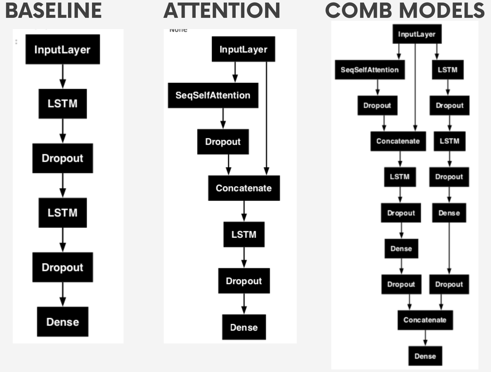

## Models for Infodengue sprint 2024/25

This repo contains the models used to forecast the dengue cases in the 2024/2025. 

To use the codes in this repository is necessary to download all the `.csv` and `.csv.gz` files made available by the sprint organizers and saved it in the data folder. The other necessaty `.csv` files are already available in the `data` folder.
## Data preprocessing 

The functions related to preprocessing the data are saved in the `preprocess_data.py`. Between then, as the model's output, according to the sprint, should be weeks 41-40, there is a function to redefine this interval as 1-52. Therefore, this function (`transform_epiweek_label`) transforms a label from epidemiological week '201041' into week '201101'. The epiweeks `53` have been removed from the data.

The neural network uses as input the dengue cases in transformer epiweeks 1-52 of the year before last (y-2) and the epiweeks 1-37 of the previous year to predict weeks 1-52 of the next year. There were tested multiple predictors that are described in the table below. **The transformed epiweek 37 refers to week 25 (considering the first week in January) it has been done since requested by the sprint rules**

**The normalized data from all the regional health departments will be used as training data. The data of each regional health is normalized considering the data of the regional health.** The preprocessing steps are highlighted in the Figures below. In general the `simple model` had a better performance (with less time training) compared with the `climate model`. 

## Models
In the `models.py` module there are functions to apply different NN architectures using LSTM layers. The models and the function associated with the architecture can be seen in the notebook: `proposed_models.ipynb`. Also the architectures are presented in the figure below:

## Training methodology

The training methodology is presented in the diagram below:

This methodology is applied in the notebook: `baseline_model.ipynb`. To train models for any state using this methodology just run the `train_model.py` and to apply the trained models to gen predictions use `apply_model.py` for the `simple model`. For the models with climate predictors use `train_model_climate.py` and `apply_model_climate.py`. The models trained are saved in the `saved_models` folder and the predictions in the `predictions` folder. To compare the predictions made by different models, take a look at the notebook: `comp_predictions.ipynb`. The `custom_loss.`ipynb` notebook contains a function to apply a custom loss for training the model to improve the performance of the baseline model. This custom loss still must be improved.  

## Results 
**The best arrangement between models and predictors is plotted in the notebook `best_models_by_state.ipynb` with details for the mandatory states according to the sprint rules: 'AM', 'CE', 'GO', 'PR', and 'MG'. The panel with the predictions is also shown below:**

Based on the paper available [here](https://arxiv.org/abs/2201.02177) the notebooks `test_grocking_CE.ipynb` and `test_grocking_PR.ipynb` train the models without early stopping and compare their performances. 

The table of the predictors is presented below:

| Feature       | Description                                                                                                    |
|---------------|----------------------------------------------------------------------------------------------------------------|
|`casos`        | Time series of cases aggregate by regional health                                                              | 
|`epiweek`      | The epiweek value                                                                                              |
|`pop_norm`     | The population of each regional health normalized by the biggest regional health population in the state       |
|`R0`           | The mean reproductive number of the epidemics notified by the Episcanner for the cities in the regional health | 
|`peak_week`    | The mean peak week of the epidemics notified by the Episcanner for the cities in the regional health           |
|`total_cases`  | The sum of the total cases of the epidemics notified by the Episcanner for the cities in the regional health   |
|`perc_geocode` | The fraction of cities in the regional health that had an epidemic identified by the Episcanner                | 
|`temp_med`     | Time series of average temperature aggregate by regional health                                                |
|`temp_amp`     | Time series of thermal amplitude aggregate by regional health                                                  |
|`rel_humid_med`| Time series of relative average humidity aggregate by regional health                                          |
|`precip_tot`   | Time series of total precipitation aggregate by regional health                                                |
|`enso`         | Time series of the enso indicator                                                                              |
|`iod`          | Time series of the iod indicator                                                                               |
|`pdo`          | Time series of the pdo indicator                                                                               |

